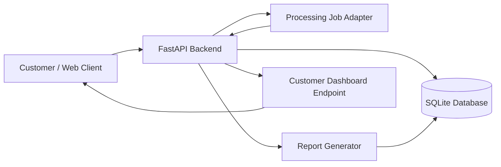
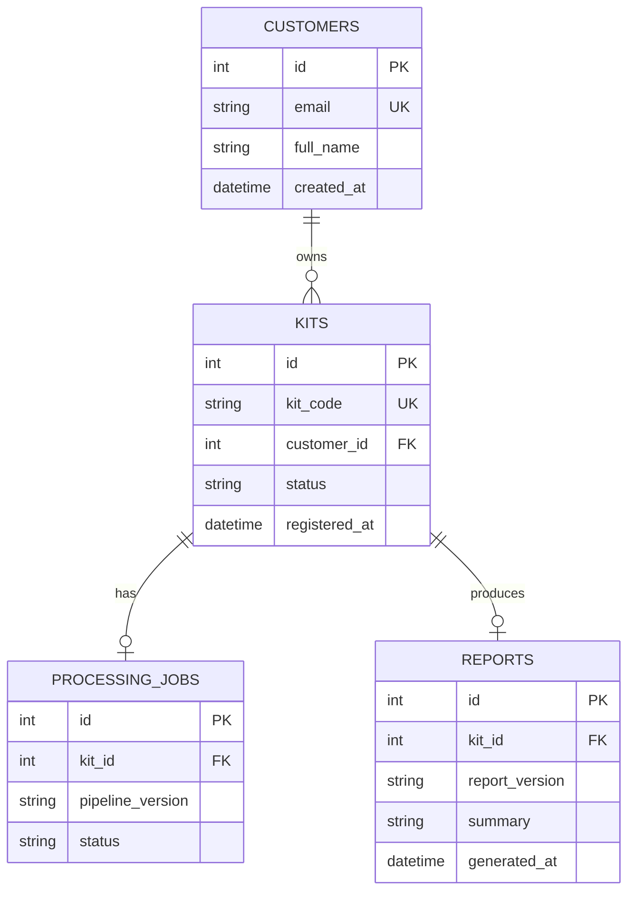

# Wellness Kit Backend Integration Sample

A small, synthetic backend project designed to demonstrate API design, relational data modeling, validation, integration flow, testing, and technical documentation.


## What it demonstrates

- REST-style API design with FastAPI
- JSON request/response contracts
- Relational data model using SQLite
- Customer-to-kit registration workflow
- Processing-job lifecycle and status tracking
- Report generation rules and dashboard delivery
- Input validation and conflict/error handling
- Basic end-to-end API testing
- Technical documentation and integration mapping

## Integration map



### Logical flow

1. A customer account is created.
2. A physical kit is registered to that customer using a unique kit code.
3. A processing job is created for the kit.
4. When the processing job succeeds, the kit becomes `completed`.
5. A report can only be created for a completed kit.
6. The dashboard endpoint combines kit, processing, and report status into one customer-facing response.

## Data model



## API endpoints

| Method | Endpoint | Purpose |
|---|---|---|
| GET | `/health` | Health check |
| POST | `/customers` | Create customer |
| POST | `/kits/register` | Link a unique kit to a customer |
| PATCH | `/kits/{kit_id}/status` | Update kit lifecycle status |
| POST | `/processing-jobs` | Create one processing job per kit |
| PATCH | `/processing-jobs/{job_id}` | Update processing status |
| POST | `/reports` | Create report only after processing completes |
| GET | `/customers/{customer_id}/dashboard` | Aggregate customer, kit, processing, and report state |

FastAPI automatically exposes OpenAPI documentation at `/docs` and `/openapi.json` while the app is running.

## Validation and reliability choices

- Kit codes must match `KIT-XXXXXXXX`.
- Customer emails are unique.
- Kit codes are unique.
- A kit must reference an existing customer.
- Only one processing job is allowed per kit.
- Only one report is allowed per kit.
- Reports cannot be generated until processing succeeds.
- SQLite foreign keys are enabled to enforce relationships.
- HTTP status codes distinguish validation errors, not-found cases, and conflicts.

## How to run

```bash
python -m venv .venv
# Windows
.venv\Scripts\activate
# macOS/Linux
source .venv/bin/activate

pip install -r requirements.txt
uvicorn app:app --reload
```

Then open:

- API docs: http://127.0.0.1:8000/docs
- OpenAPI JSON: http://127.0.0.1:8000/openapi.json

Run tests:

```bash
pytest -q
```

## Example request

```json
POST /kits/register
{
  "kit_code": "KIT-AB12CD34",
  "customer_id": 1
}
```

Example response:

```json
{
  "id": 1,
  "kit_code": "KIT-AB12CD34",
  "customer_id": 1,
  "status": "registered"
}
```
